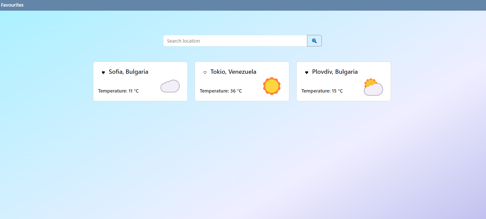
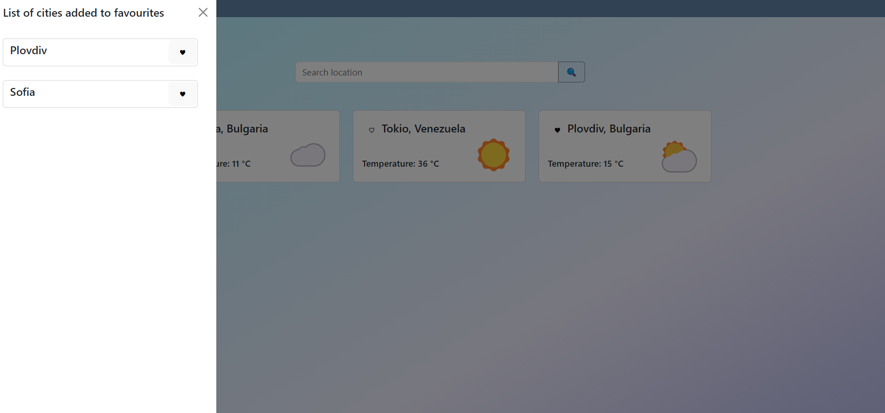
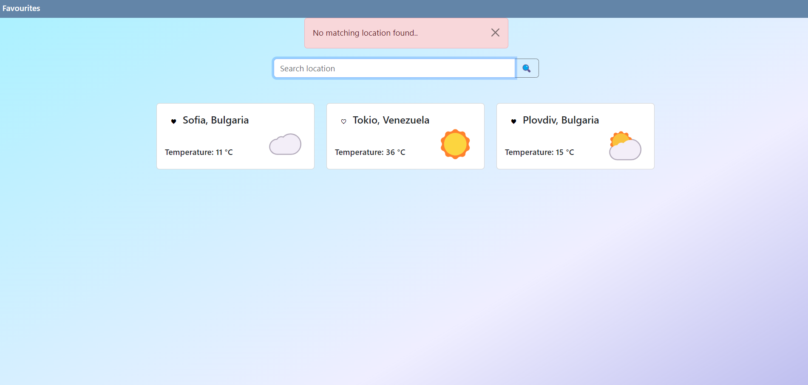

## Project Real-Time Weather App

#### Description

TweetWorld 

An application used to fetch and display weather data from a public API, built with React, TypeScript, Redux.

## Project Screen Shot(s)

## Installation and Setup Instructions

####   

Clone down this repository. You will need `node` and `npm` installed globally on your machine.  

Installation:

`npm install`  

To Start App:

`npm run dev`  

To Visit App:

`localhost:5173`  